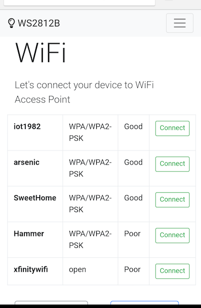
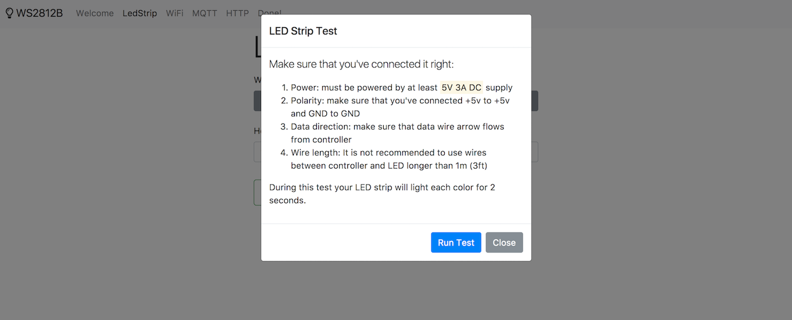
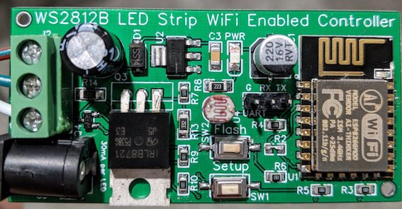

## WS2812b LED Wifi Enabled Controller

... here will be documentation soon...

Work in progress for now... Stay tuned..

Yahooo, I've got some working prototype!

### UI screenshots

### Prototype

----
P.S. While software is being developed checkout these hardware part:
* Schematic: https://easyeda.com/normal/schematic-ad064e31e8404d9ea8c5efc4c6ff6607
* PCB design: https://easyeda.com/editor#id=044903af465c45638a47e1e123004e89
